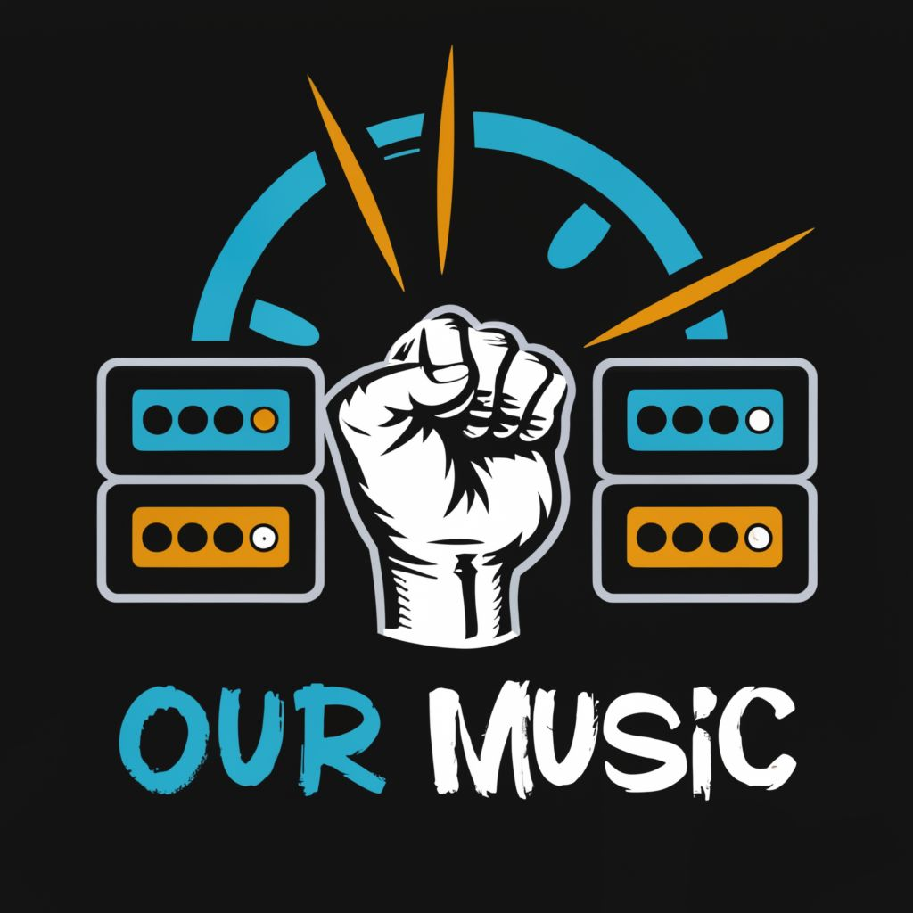

# Ourmusic - Is it theirs? No, it's public!

Create a public audio library

A community-driven server that generates audio tracks, where users can enter
and edit data for audio files. It has a moderation system that allows you to
monitor compliance with standards and the relevance of the data provided by
users. A built-in audio site scraper provides the ability to conveniently
select audio files from various online sources to expand the available material
in the library.

